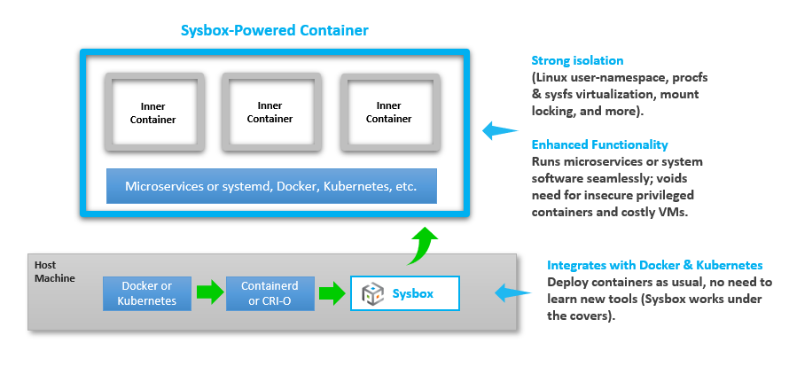
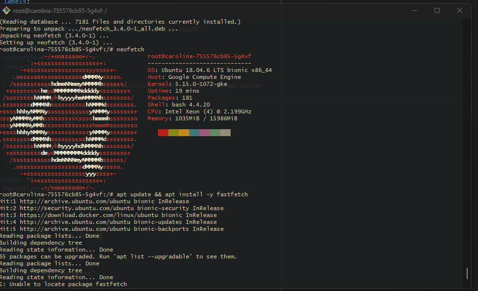

# Running Sysbox Using a Managed GKE Cluster



### What is Sysbox?
Sysbox is an open-source container runtime designed to enhance container isolation and enable containers to run workloads traditionally reserved for virtual machines. Originally developed by Nestybox and later acquired by Docker in 2022, Sysbox functions as a specialized "runc" that integrates seamlessly with existing container managers like Docker and Kubernetes.

Unlike standard containers, Sysbox enforces strict isolation by leveraging Linux user namespaces, virtualizing key system directories such as procfs and sysfs, and hiding host system details within the container. This allows workloads to run securely without requiring privileged mode or complex configurations. With Sysbox, system-level applications like systemd, Docker, Kubernetes, K3s, and buildx can run inside containers without modifications, rootless variants, or special volume mounts.

Sysbox coexists with other container runtimes on the same host, allowing users to choose the appropriate runtime per workload without disrupting existing workflows. Sysbox acts as a "container supercharger," enabling hardened, VM-like containers that expand the capabilities of Kubernetes and Docker without requiring new tools or changes to existing container images.

- *Within our context, Sysbox allows you to orchestrate workloads on **Google Kubernetes Engine (GKE)** as if they were **cloud provider VMs**, while retaining the **flexibility and scalability of managed microservices** within a Kubernetes environment.*

---
### Environment Preparation 

To ensure compatibility, you’ll need to modify key Kubernetes settings within your cluster configuration. Below are the necessary adjustments when deploying your GKE cluster via Terraform.

##### Node Operating System Requirements

The image type for your GKE nodes must be set to one of the following Ubuntu-based operating systems:

- Ubuntu
- Jammy
- Focal
- Bionic
##### Node Image Requirements

This ensures the necessary kernel support and compatibility for advanced container runtime features.
*In my Configuration we will use Ubuntu stacked with containerd as an example.*
```python
image_type = "UBUNTU_CONTAINERD"
```

##### Node Performance Requirements

At a minimum each node's system needs to have at least 4 CPUS and 16GB RAM available.
In your terraform files adjust  the machine type to the minimum GCP equivalent:

```python
machine_type = "e2-standard-4"
```

The below code shows an example of my`node_pool` resource in terraform. Use this as a guide to correctly place the above 2 arguments within your own terraform manifest.

*Notice how our resources are declared within the node config brackets of our node pool.*
```python
#Node-Pools
resource "google_container_node_pool" "node-pool-1" {
  name       = var.kube.pool_name
  location   = var.kube.subnet_region
  cluster    = var.kube.fleet_name
  node_count = 1

  autoscaling {
    min_node_count = var.kube.min_count
    max_node_count = var.kube.max_count
  }
  management {
    auto_repair  = true
    auto_upgrade = true
  }
  #>>>>>
    node_config {     
    machine_type    = "e2-standard-4" #Add or change this line
    image_type = "UBUNTU_CONTAINERD" #Add or change this line
    preemptible = false
    labels = {
      role = "sardaukar"
    }
    service_account = "876288284083-compute@developer.gserviceaccount.com"#
    oauth_scopes    = [ 
      /*"https://www.googleapis.com/auth/logging.write",
      "https://www.googleapis.com/auth/monitoring",
      "https://www.googleapis.com/auth/devstorage.read_only",
      "https://www.googleapis.com/auth/servicecontrol",
      "https://www.googleapis.com/auth/service.management.readonly",
      "https://www.googleapis.com/auth/trace.append",*/
      "https://www.googleapis.com/auth/cloud-platform"
    ]
  }
  depends_on = [google_container_cluster.fleet-1]
}
#>>>>>
```

---
### Sysbox Deployment Steps

After your Cluster is configured with our desired settings and is in a state of successfully running, we can begin to write our YAMLS and prepare for our initial deployment. 

##### 1. Node Labels

 First we begin by labeling the nodes within our cluster with the `sysbox-install=yes` label. 

-   Only nodes with these labels will be able to run Sysbox. This will allow you to define where your Sysbox  resources can live on you cluster.

*We use the get nodes command to view all nodes in the cluster then label each one indivdually.*
``` shell
User@Caranthir MINGW64 /c/terraform/anton/module-practice
$ kubectl get nodes
NAME                                             STATUS   ROLES    AGE    VERSION
gke-atreides-war-fleet-sardaukar-192d0ddf-vpsb   Ready    <none>   100m   v1.31.4-gke.1372000
gke-atreides-war-fleet-sardaukar-21a8d3bf-cs2f   Ready    <none>   100m   v1.31.4-gke.1372000
gke-atreides-war-fleet-sardaukar-b6cba1de-bcdj   Ready    <none>   100m   v1.31.4-gke.1372000

User@Caranthir MINGW64 /c/terraform/anton/module-practice
$ kubectl label nodes gke-atreides-war-fleet-sardaukar-192d0ddf-vpsb sysbox-install=yes
node/gke-atreides-war-fleet-sardaukar-192d0ddf-vpsb labeled

User@Caranthir MINGW64 /c/terraform/anton/module-practice
$ kubectl label nodes gke-atreides-war-fleet-sardaukar-21a8d3bf-cs2f sysbox-install=yes
node/gke-atreides-war-fleet-sardaukar-21a8d3bf-cs2f labeled

User@Caranthir MINGW64 /c/terraform/anton/module-practice
$ kubectl label nodes gke-atreides-war-fleet-sardaukar-b6cba1de-bcdj sysbox-install=yes
node/gke-atreides-war-fleet-sardaukar-b6cba1de-bcdj labeled
```

##### 2. DaemonSet Deployment 

- Once all desired nodes are correctly labeled, apply the following YAML configuration to provision the baseline environment for Sysbox within your Kubernetes cluster. This ensures that the necessary runtime and dependencies are properly configured across your nodes.

`kubectl apply -f https://raw.githubusercontent.com/nestybox/sysbox/master/sysbox-k8s-manifests/sysbox-install.yaml`

*NOTE: the above step will restart the Kubelet on all nodes where Sysbox is being installed, causing all pods on the node to be stopped and re-created. Depending on the number of pods, this process can take anywhere from 30 secs to 2 minutes. Wait for this process to complete before proceeding.*

*Successful Output Example*
```shell
serviceaccount/sysbox-label-node created
clusterrole.rbac.authorization.k8s.io/sysbox-node-labeler created
clusterrolebinding.rbac.authorization.k8s.io/sysbox-label-node-rb created
configmap/sysbox-operational-attributes created
daemonset.apps/sysbox-deploy-k8s created
runtimeclass.node.k8s.io/sysbox-runc created
```

- *Installing Sysbox on a node does not imply all pods on the node are deployed with Sysbox. You can choose which pods use Sysbox via the pod's spec (see Pod Deployment below). Pods that don't use Sysbox continue to use the default low-level runtime (i.e., the OCI runc) or any other runtime you choose.*

##### 3. Deploying Our First Sysbox container

Sysbox can deploy container images that act as full blown VMs within the pods of your cluster.
The below steps and manifest describe the necessary YAML components and an example of a successful execution. 
##### Required Traits
- Annotations: `io.kubernetes.cri-o.userns-mode: "auto:size=65536"`
- runtime class: `runtimeClassName: sysbox-runc`
- Sysbox operating system image: `image: registry.nestybox.com/nestybox/ubuntu-bionic-systemd-docker`
- Initialization command: `command: ["/sbin/init"]`

Please see the below YAML for proper usage and a working example of a basic deployment:
```yaml
apiVersion: apps/v1
kind: Deployment
metadata:
  name: carolina
  namespace: default
  annotations:
    io.kubernetes.cri-o.userns-mode: "auto:size=65536" #
spec:
  replicas: 3  # Adjust the number of pods
  selector:
    matchLabels:
      app: carolina
  template:
    metadata:
      labels:
        app: carolina
      annotations:
        io.kubernetes.cri-o.userns-mode: "auto:size=65536"
    spec:
      runtimeClassName: sysbox-runc
      restartPolicy: Always      
      containers:
      - name: ubu-bio-systemd-docker
        image: registry.nestybox.com/nestybox/ubuntu-bionic-systemd-docker
        command: ["/sbin/init"]
        volumeMounts:          
        - name: orbiter-module
          mountPath: /pvc/
      volumes:
      - name: orbiter-module
        persistentVolumeClaim:
          claimName: orbiter-module
---
apiVersion: v1
kind: PersistentVolumeClaim
metadata:
  name: orbiter-module
  namespace: default
spec:
  accessModes: ["ReadWriteOnce"]
  resources:
    requests:
      storage: 1Gi
  storageClassName: "bordeaux"
```

If using my Repository, Run the following command
```shell
User@Caranthir MINGW64 /c/terraform/anton/module-practice
$ kubectl apply -f deploy-me
```

The pods we've deployed should have a healthy status. 

- Use `kubectl get pods` to retrieve the names of your pods for the next steps to prove functionality
```shell
User@Caranthir MINGW64 /c/terraform/anton/module-practice
$ kubectl get pods
NAME                        READY   STATUS              RESTARTS   AGE
carolina-755576cb85-29n25   0/1     ContainerCreating   0          29s
carolina-755576cb85-5g4vf   1/1     Running             0          29s
carolina-755576cb85-v46t2   0/1     ContainerCreating   0          29s
```

##### 4. Testing Functionality

Once you've selected a pod you wish to demo Sysbox, Use the following command to execute into your running containers and use them like an real Ubuntu VM:

*I run LS to view all active directories*
```shell
User@Caranthir MINGW64 /c/terraform/anton/module-practice
$ winpty kubectl exec -it carolina-755576cb85-5g4vf -- bin/bash
root@carolina-755576cb85-5g4vf:/# ls
bin  boot  dev  etc  get-docker.sh  home  lib  lib64  media  mnt  opt  proc  pvc  root  run  sbin  srv  sys  tmp  usr  var
```

- Once inside this pod, you have full control and can use it just like a traditional VM within a cloud environment.

By default, pods inherit host resources, meaning that if your cluster nodes are highly performant, this configuration enables the orchestration of fully managed virtualized machines—leveraging all the benefits of microservices within a scalable Kubernetes cluster.


- Below is a series of commands used to install Neofetch and retrieve system logs from within our enhanced container setup, demonstrating its functionality.

*This proves the functionality of the tool*
```shell
root@carolina-755576cb85-5g4vf:/# ls
bin  boot  dev  etc  get-docker.sh  home  lib  lib64  media  mnt  opt  proc  pvc  root  run  sbin  srv  sys  tmp  usr  var
root@carolina-755576cb85-5g4vf:/# apt update && apt install -y neofetch
Get:1 https://download.docker.com/linux/ubuntu bionic InRelease [64.4 kB]
Get:2 http://security.ubuntu.com/ubuntu bionic-security InRelease [102 kB]
Get:3 http://archive.ubuntu.com/ubuntu bionic InRelease [242 kB]
Get:4 https://download.docker.com/linux/ubuntu bionic/stable amd64 Packages [46.4 kB]
Get:5 http://archive.ubuntu.com/ubuntu bionic-updates InRelease [102 kB]
Get:6 http://security.ubuntu.com/ubuntu bionic-security/universe amd64 Packages [1637 kB]
Get:7 http://archive.ubuntu.com/ubuntu bionic-backports InRelease [102 kB]
Get:8 http://archive.ubuntu.com/ubuntu bionic/restricted amd64 Packages [13.5 kB]
Get:9 http://archive.ubuntu.com/ubuntu bionic/universe amd64 Packages [11.3 MB]
Get:10 http://security.ubuntu.com/ubuntu bionic-security/restricted amd64 Packages [1688 kB]
Get:11 http://security.ubuntu.com/ubuntu bionic-security/main amd64 Packages [3373 kB]
Get:12 http://security.ubuntu.com/ubuntu bionic-security/multiverse amd64 Packages [23.8 kB]
Get:13 http://archive.ubuntu.com/ubuntu bionic/main amd64 Packages [1344 kB]
Get:14 http://archive.ubuntu.com/ubuntu bionic/multiverse amd64 Packages [186 kB]
Get:15 http://archive.ubuntu.com/ubuntu bionic-updates/multiverse amd64 Packages [30.8 kB]
Get:16 http://archive.ubuntu.com/ubuntu bionic-updates/universe amd64 Packages [2411 kB]
Get:17 http://archive.ubuntu.com/ubuntu bionic-updates/main amd64 Packages [3786 kB]
Get:18 http://archive.ubuntu.com/ubuntu bionic-updates/restricted amd64 Packages [1728 kB]
Get:19 http://archive.ubuntu.com/ubuntu bionic-backports/main amd64 Packages [64.0 kB]
Get:20 http://archive.ubuntu.com/ubuntu bionic-backports/universe amd64 Packages [20.6 kB]
Fetched 28.3 MB in 3s (8110 kB/s)
Reading package lists... Done
Building dependency tree
Reading state information... Done
65 packages can be upgraded. Run 'apt list --upgradable' to see them.
Reading package lists... Done
Building dependency tree
Reading state information... Done
The following NEW packages will be installed:
  neofetch
0 upgraded, 1 newly installed, 0 to remove and 65 not upgraded.
Need to get 74.8 kB of archives.
After this operation, 365 kB of additional disk space will be used.
Get:1 http://archive.ubuntu.com/ubuntu bionic/universe amd64 neofetch all 3.4.0-1 [74.8 kB]
Fetched 74.8 kB in 0s (374 kB/s)
debconf: delaying package configuration, since apt-utils is not installed
Selecting previously unselected package neofetch.
(Reading database ... 7181 files and directories currently installed.)
Preparing to unpack .../neofetch_3.4.0-1_all.deb ...
Unpacking neofetch (3.4.0-1) ...
Setting up neofetch (3.4.0-1) ...
root@carolina-755576cb85-5g4vf:/# neofetch
            .-/+oossssoo+/-.               root@carolina-755576cb85-5g4vf
        `:+ssssssssssssssssss+:`           ------------------------------
      -+ssssssssssssssssssyyssss+-         OS: Ubuntu 18.04.6 LTS bionic x86_64
    .ossssssssssssssssssdMMMNysssso.       Host: Google Compute Engine
   /ssssssssssshdmmNNmmyNMMMMhssssss/      Kernel: 5.15.0-1072-gke
  +ssssssssshmydMMMMMMMNddddyssssssss+     Uptime: 19 mins
 /sssssssshNMMMyhhyyyyhmNMMMNhssssssss/    Packages: 181
.ssssssssdMMMNhsssssssssshNMMMdssssssss.   Shell: bash 4.4.20
+sssshhhyNMMNyssssssssssssyNMMMysssssss+   CPU: Intel Xeon (4) @ 2.199GHz
ossyNMMMNyMMhsssssssssssssshmmmhssssssso   Memory: 1035MiB / 15986MiB
ossyNMMMNyMMhsssssssssssssshmmmhssssssso
+sssshhhyNMMNyssssssssssssyNMMMysssssss+
.ssssssssdMMMNhsssssssssshNMMMdssssssss.
 /sssssssshNMMMyhhyyyyhdNMMMNhssssssss/
  +sssssssssdmydMMMMMMMMddddyssssssss+
   /ssssssssssshdmNNNNmyNMMMMhssssss/
    .ossssssssssssssssssdMMMNysssso.
      -+sssssssssssssssssyyyssss+-
        `:+ssssssssssssssssss+:`
            .-/+oossssoo+/-.
root@carolina-755576cb85-5g4vf:/#

```



And that's it. This deployment was fairly simple to execute and configure. Read official documentation for other deployments and guidelines:

- https://github.com/nestybox/sysbox
- https://github.com/nestybox/sysbox/blob/master/docs/quickstart/README.md
- https://github.com/nestybox/sysbox/blob/master/docs/user-guide/README.md

---